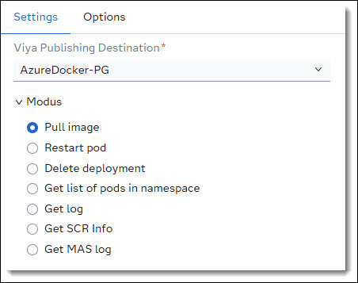
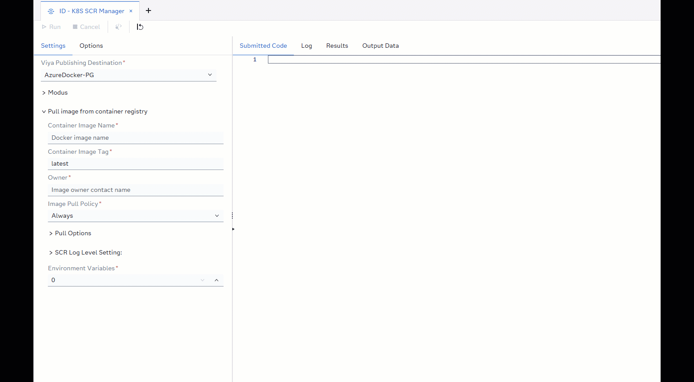
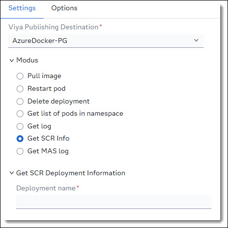

# `k8s-scr-mgr`: Service Container for SAS Viya SCR
`k8s-scr-mgr` is a service container designed to support developers working with SAS Viya by enabling the loading of SAS Container Runtime (SCR) images into Kubernetes. This tool is especially useful during the development phase when decision flows or models are published to a Docker Registry, but developers may not have direct access to the Kubernetes cluster.

## Features
Once deployed, the `k8s-scr-mgr` container provides a service accessible via custom step *ID - K8S SCR Manager* in SAS Studio to:

🔷 **Load** SCR images into Kubernetes<br>
🔷 **Restart** launched SCR containers<br>
🔷 **Delete** SCR container deployments<br>
🔷 **List** all pods running in the dedicated Kubernetes namespace<br>
🔷 **Show** log for SCR container<br>
🔷 **Show** SCR Kubernetes deployment information<br>
🔷 **Show MAS** log for information<br>

> ⚠️ For security reasons, all SCR containers are loaded into **dedicated namespaces**. The default namespace is *scr*. You can overwrite the default namespace when installing *k8s-scr-mgr*.

---

## Installation Guide
You can install k8s-scr-mgr using helm chart or you can install it manually.

### Installing via Helm Chart
```helm install k8s-scr-mgr oci://ghcr.io/sukckn/k8sscrmgr```<br>
To install the chart, you need to set some required parameters - see below. <br>
Here a list of common parameters when installing the chart:

| | Parameter | Comment | Required |
| --- | --- | --- | --- |
| | namespace | The namespace where *k8s-scr-mrg* is going to be installed.<br>**Default**: default | No |
| set | k8sScrMgr.viyaNamespace | The namespace where Viya is installed.<br>**Default**: viya | No |
| set | k8sScrMgr.host | The external URL where *k8s-scr-mrg* is going to be installed. | Yes |
| set-file | k8sScrMgr.kubeconfig | Fully qualified file name for the kubectl config file. | Yes |
| set | scr[0].publishingDestination | The SAS Viya Publishing Destination name for which you configure *k8s-scr-mrg*. | Yes | 
| set | scr[0].dockerCredentials.baseRepoURL | The container registry location (URI). | Yes |
| set | scr[0].dockerCredentials.registryId | The container registry user ID. | Yes |
| set-string | scr[0].dockerCredentials.registryPassword | The container registry password. | Yes |
| set-string | scr[0].dbCredentials | Database connection string. Use the same string that is used in Viya Environment Manager to connect from MAS.<br>**Note**: Enclose connection string in double quotes! | No |
| set | scr[0].namespace | Namespace where to load the SCR container.<br>**Default**:scr (only for namespace[0]).<br>**Note**:For scr[1...] namespace is required! | No/Yes |

Example to install the chart with the release name *k8s-scr-mrg*:

```
helm install k8s-scr-mgr oci://ghcr.io/sukckn/k8sscrmgr \
--namespace k8sscrmgr \
--create-namespace \
--set k8sScrMgr.viyaNamespace=viya4 \
--set k8sScrMgr.host=my-server.net.sas.com \
--set-file k8sScrMgr.kubeconfig=$HOME/.kube/config \
--set scr[0].publishingDestination=AzureDocker-PG \
--set-string scr[0].dbCredentials="driver=sql;conopts=((driver=postgres;catalog=public;uid=mysas;pwd='asddsa';server= pg-demo-postgresql.default.svc.cluster.local;port=5431;DB=postgres;))" \
--set scr[0].dockerCredentials.baseRepoURL=myregistry.azurecr.io \
--set scr[0].dockerCredentials.registryId=myregistry \
--set-string scr[0].dockerCredentials.registryPassword=w3Z6bWrCr0NQMdL+NRoQbVCvdcBOcZZgURtIRKLq+ACRAbPp
``` 

<details>
<summary>Additional install parameters</summary>

| | Parameter | Comment | Required |
| --- | --- | --- | --- |
| set | k8sScrMgr.container_prefix | The prefix will be added to the SCR image name. All created components in Kubernetes will have the prefix. E.g.: If prefix 'scr' is set and the SCR image is called 'abc' the created components in Kubernetes are named 'scr-abc'<br>**Default:** scr | No |
| set | k8sScrMgr.mas_pod | The prefix name of the MAS pod.<br>**Default:** sas-microanalytic-score | No |
| set | k8sScrMgr.list_scr | Enables the /list-scr endpoint to display pod statuses in the namespace.<br>**Default:** True | No |
| set | k8sScrMgr.pull_scr | Enables the /k8s-scr-mgr endpoint to pull images from the Docker registry and load them into Kubernetes.<br>**Default:** True | No |
| set | k8sScrMgr.restart_scr | Enables the /restart-scr endpoint to restart pods.<br>**Default:** True | No |
| set | k8sScrMgr.delete_scr | Enables the /delete-scr endpoint to delete pods and deployments.<br>**Default:** True | No |
| set | k8sScrMgr.getlog_scr | Enables the /getlog-scr endpoint to receive the log for a scr container.<br>**Default:** True | No |
| set | k8sScrMgr.getinfo_scr | Enables the /getinfo-scr endpoint to receive SCR deploment information.<br>**Default:** True | No |
| set | k8sScrMgr.getlog_mas | Enables the /getlog-mas endpoint to receive the log for MAS.<br>**Default:** True | No |
| set-file | k8sScrMgr.scr_yaml_template | Fully qualified file name for the scr yaml file to load the SCR container. See [Yaml file to load SCR Container](#yaml-file-to-load-scr-container) for more information.<br>**Default:** If not used the default SCR yaml template is used. | No |
</details>

> :bulb: **Tip**: See annotation *helm.sh/uninstall* in Kubernetes deployment for helm uninstall command.

#### Configure for more than one Viya Publishing Destination
If you publish to different container registries and therefore have more than one Docker publishing destination in Viya, you can configure *k8s-scr-mgr* to pull from different publishing destinations. 

For each publishing destination you need to set:
* scr[x].publishingDestination
* scr[x].namespace
* scr[x].dockerCredentials.baseRepoURL
* scr[x].dockerCredentials.registryId
* scr[x].dockerCredentials.registryPassword
* scr[x].dbCredentials (optional)

The *x* in *scr[x]* identifies the number of the container registry you want to register. Use continues numbers. The first container registry starts with 0 and is compulsory.

#### Yaml file to load SCR Container
By default, a yaml file template is used to load the SCR container into Kubernetes. You can overwrite the default template to adjust Kubernetes settings when loading a SCR container.
Download the [template file](./data/config/scr-template.yaml) and edit the file as appropriate.
You can load the template file using helm parameter *k8sScrMgr.scr_yaml_template*

---

### Manual Installation Guide
See [instructions](manual-install.md) for manual install.

---

## ID - K8S SCR Manager
The **ID - K8S SCR Manager** custom step allows you to interact with the k8s-scr-mgr service from within SAS Viya using SAS Studio. This step supports operations such as:<br>

🔷 **Load** SCR images into Kubernetes<br>
🔷 **Restart** launched SCR containers<br>
🔷 **Delete** SCR container deployments<br>
🔷 **List** all pods running in the dedicated Kubernetes namespace<br>
🔷 **Show** log for SCR container<br>
🔷 **Show** SCR Kubernetes deployment information<br>
🔷 **Show MAS** log for information<br>

---

### Import the Custom Step
To import custom step *ID - K8S SCR Manager*:
* Open SAS Studio.
* In your home folder (My Folder), create a sub-folder named ```custom steps```.
* Upload file [ID - K8S SCR Manager.step](./data/custom_step/ID%20-%20K8S%20SCR%20Manager.step) into the *custom steps* folder.

### Configure Custom Step
* **Service URL**: Make sure the service URL for the customer step is correct. When you have installed *scr-k8s-mgr* via helm chart you can see the service URL at the end of the installation. 
Use this URL in the custom step. In SAS Studio open the step in edit mode. Go to tab *Options* and ensure that the service URL is correct. Save the step.
* **Publishing Destinations**: To set the registered Publishing destinations, open the step in edit mode, highlight control drop-down-list *Viya Publishing Destination* and set all publishing destinations you have registered with *k8s-scr-mrg*. Save the step.

---

### User Interface
#### Modus
Use this section to choose the operation you want to perform:



* **Viya Publishing Destination**<br>
    Select the Viya Publishing Destination for which you want to run the operations.
* **Pull Image**<br>
    Load a SCR image from the Docker registry into Kubernetes.
* **Restart** pod<br>
    Restart a pod, typically after publishing a new version of an SCR image.
* **Delete deployment**<br>
    Remove an SCR deployment from Kubernetes.
* **Get list of pods in namespace**<br>
    Retrieve a list of pods in the *scr-pull* namespace, including status and age information.
* **Get SCR Info**<br>
    Retrieve SCR deployment information including currently set environment variables.
* **Get log**<br>
    Retrieve the log for a container in the dedicated namespace.
* **Get MAS log**<br>
    Retrieve the log information from MAS.

---

#### Pull image
Load a SCR image from the Docker registry into Kubernetes.


* **Container Image Name**<br>
The name of the SCR container image in the Docker registry
* **Container Image Tag**<br>
The tag name of the image you want to load. E.g.: latest or 6
* **Image Pull Policy**,br
Set how the image should get pulled if the pod gets restarted.<br>
Options:
    * Always (default)<br>
    The Kubelet will always attempt to pull the image from the registry every time a container is launched
    * IfNotPresent<br>
    The Kubelet will only pull the image if it is not already present on the node. If a local copy exists, it will be used without checking the registry for updates
    * Never<br>
    It will only use a locally available image. If the image is not found locally, the container launch will fail. This policy is typically used for development or air-gapped environments where images are pre-loaded onto nodes
* **Replicas**<br>
Set the number of pods to start. 
* **Owner**<br>
Set a Kubernetes label for the owner of the scr image. Information who to contact about the image. 
    * Max 63 characters.
    * Lowercase / uppercase letters: A–Z a–z
    * Numbers: 0–9
    * Special characters: - _ .
    * Start and end with an alphanumeric character.

    >❗**Note**: If not set the SAS Studio Client ID will be used.
* **Pull Options**
    * **Deployment Name**<br>
        By default the SCR image name is used as deployment name. You can set a different deployment name, for example if you want to load different versions of the same image.
    * **SCR Endpoint**<br>
        By default the SCR endpoint is the same as the deployment name. E.g., if the image name is abc the endpoint is myServer.com/abc.<br>You can change the default endpoint. For example, if you load two images with the same name into two different namespaces you have to use different endpoints.
* **SCR Log Level Settings**<br>
    In this section you find a list of all available SCR loggers, that you can set with their appropriate log level.
* **Environment Variables**<br>
Set the number of environment variables you want to set for the scr container
* **Environment Variable**<br>
    * **Name**<br>
    Name of the environment variable
    * **Value**<br>
    Environment variable value

>❗**Note:** When you have loaded a SCR container, you will get a list of all *loggers* and *environment variables* that have been set.

>❗**Note:** You can change the loggers and environment variables by running *Pull image* again. When doing this you have to use the same value for *Owner* as you have used when you deployed it the first time. 

<details><summary>Load SCR image</summary>

*
    <details>
    <summary>Load SCR image</summary>

    
    </details>

*
    <details>
    <summary>Load SCR image (using SCR logger)</summary>

    
    </details>
</details>

---

#### Restart pod


* **Deployment name**<br>
Set the name of the scr deployment you want to re-start.

---

#### Delete deployment


* **Deployment name**<br>
Set the name of the scr deployment you want to delete.
---

#### Get list of pods in namespace


Run the step to receive a list of all pods running in the namespace linked to k8s-scr-mgr.

---

#### Get log


* **Pod name**<br>
The name of the pod for which you want the log information.<br>
You don't need to type in the complete pod name, portion of it will work. E.g.: if the pod name is 'scr-mypod-7b7c55d84b-2fm87' you can just type 'mypod'.

* **Show rows in log**
This indicates how many rows from the log will be shown.
    * All rows<br>
    Shows the complete log
    * Top rows<br>
    Show the top number of rows as set in field **Number of rows**
    * Bottom rows<br>
    Show last number of rows as set in field **Number of rows**

---

#### Get SCR Info


* **Deployment name**<br>
The name of the deployment for which you want retrieve information.<br>
Following information will be shown:
    * Deployment Name
    * Namespace
    * App-Owner
    * SCR Image Name
    * SCR Image Tag
    * Container Registry
    * Image Pull Policy
    * Replicas
    * Internal SCR URL
    * External SCR URL
    * List of currently set environment variables
    * List of SCR Loggers currently set

---

#### Get MAS log


* **Show rows in log**
This indicates how many rows from the log will be shown.
    * All rows<br>
    Shows the complete log
    * Top rows<br>
    Show the top number of rows as set in field **Number of rows**
    * Bottom rows<br>
    Show last number of rows as set in field **Number of rows**

    > By default, it will show the last 30 rows in the log.

<br>

---

### Options


Configure the URL for the *k8s-scr-mgr* service. The default is:
```
k8s-scr-mgr.default.svc.cluster.local
```
If *k8s-scr-mgr* is not deployed to namespace ```default```, update the URL using the format:
```
<pod-name>.<namespace>.svc.cluster.local
```
Alternatively, you can set the Service URL by setting macro ```K8S_SCR_MGR_URL```. This could be done in the *SAS Studio Autoexec file*, to automatically set the URL every time you start *SAS Studio*.:
```
%let k8s_scr_mgr_url= %nrquote(k8s-scr-mgr.mynamespace.svc.cluster.local);

```