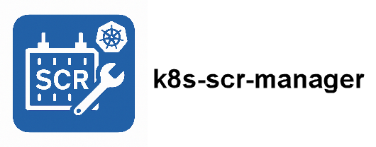

# `k8s-scr-mgr`: Service Container for SAS Viya SCR
`k8s-scr-mgr` is a service container designed to support developers working with SAS Viya by enabling the loading of SAS Container Runtime (SCR) images into Kubernetes. This tool is especially useful during the development phase when decision flows or models are published to a Docker Registry but developers may not have direct access to the Kubernetes cluster.

## Features
Once deployed, the `k8s-scr-mgr` container provides a service accessible via custom step *ID - K8S SCR Manager* in SAS Studio to:

🔷 **Load** SCR images into Kubernetes<br>
🔷 **Restart** launched SCR containers<br>
🔷 **Delete** SCR container deployments<br>
🔷 **List** all pods running in the dedicated Kubernetes namespace<br>
🔷 **Show** log for SCR container<br>
🔷 **Show MAS** log for information<br>

> ⚠️ For security reasons, all SCR containers are loaded into a ** dedicated namespace**.

---

## Installation Guide
Install k8s-scr-mgr using helm chart or you can install it manually.

### Installing via Helm Chart
To install the chart you need to set some required parameters - see below. <br>
here a list of common parameters used to install the chart:

| | Parameter | Comment | Required |
| --- | --- | --- | --- |
| | namespace | The namespace where *k8s-scr-mrg* is going to be installed.<br>**Default**: default | No |
| set | installName | The name under which *k8s-scr-mrg* is going to be installed.<br>**Default**: \<release name\>-\<chart name\> | No |
| set | k8sScrMgr.viya_namespace | The namespace where Viya is installed.<br>**Default**: viya | No |
| set | k8sScrMgr.host | The external URL where *k8s-scr-mrg* is going to be installed. | Yes |
| set-file | k8sScrMgr.kubeconfig | Fully qualified file name for the kubectl config file | Yes |
| set | dockerCredentials.baseRepoURL | The container registry location (URI) | Yes |
| set | dockerCredentials.registryId | The container registry user ID | Yes |
| set | dockerCredentials.registryPassword | The container registry password | Yes |
| set | dbCredentials.connectionstring | Database connection string. Use the same string that is used in Viya Environment manager to connect from MAS.<br>**Note**: Enclose connection string in double quotes! | No |


Example to install the chart with the release name *k8s-scr-mrg*:

```
helm install k8s-scr-mgr helm install k8s-scr-mgr oci://ghcr.io/sukckn/k8sscrmgr \
--namespace k8sscrmgr \
--create-namespace \
--set installName=k8s-scr-mgr \
--set k8sScrMgr.viya_namespace=viya4 \
--set k8sScrMgr.host=my-server.net.sas.com \
--set-file k8sScrMgr.kubeconfig=$HOME/.kube/config \
--set dockerCredentials.baseRepoURL=myregistry.azurecr.io \
--set dockerCredentials.registryId=myregistry \
--set dockerCredentials.registryPassword=NRoQbVCvdcBOcZZgURtIRKLq+ACRAbPpCz \
--set dbCredentials.connectionstring="driver=sql;conopts=((driver=postgres;catalog=public;uid=mysas;pwd='asddsa';server= pg-demo-postgresql.default.svc.cluster.local;port=5431;DB=postgres;))"
``` 

<details>
<summary>Additional install parameters</summary>

| | Parameter | Comment | Required |
| --- | --- | --- | --- |
| set | k8sScrMgr.base_url | Base endpoint of the *k8s-scr-mgr* container. If running multiple instances, assign a unique endpoint per instance <br>**Default:** /k8s-scr-mgr | No |
| set | k8sScrMgr.port | Target port for the *k8s-scr-mgr* container.<br>**Default:** 8080 | No |
| set | k8sScrMgr.container_prefix | The prefix will be added to the SCR image name. All created components in Kubernetes will have the prefix. E.g.: If prefix 'scr' is set and the SCR image is called 'abc' the created componentes in Kubernetes are named 'scr-abc'<br>**Default:** scr | No |
| set | k8sScrMgr.mas_pod | The prefix name of the MAS pod.<br>**Default:** sas-microanalytic-score | No |
| set | k8sScrMgr.list_scr | Enables the /list-scr endpoint to display pod statuses in the namespace.<br>**Default:** True | No |
| set | k8sScrMgr.pull_scr | Enables the /k8s-scr-mgr endpoint to pull images from the Docker registry and load them into Kubernetes.<br>**Default:** True | No |
| set | k8sScrMgr.restart_scr | Enables the /restart-scr endpoint to restart pods.<br>**Default:** True | No |
| set | k8sScrMgr.delete_scr | Enables the /delete-scr endpoint to delete pods and deployments.<br>**Default:** True | No |
| set | k8sScrMgr.getlog_scr | Enables the /getlog-scr endpoint to receive the log for a scr container.<br>**Default:** True | No |
| set | k8sScrMgr.getlog_mas | Enables the /getlog-mas endpoint to receive the log for MAS.<br>**Default:** True | No |
| set-file | k8sScrMgr.scr_yaml_template | Fully qualified file name for the scr yaml file to load the SCR container. See [Yaml file to load SCR Container](#yaml-file-to-load-scr-container) for more information.<br>**Default:** If not used the default SCR yaml template is used. | No |
</details>

> :bulb: **Tip**: See annotation *helm.sh/uninstall* in Kubernetes deployment for helm uninstall command.

#### Yaml file to load SCR Container
By default a yaml file template is used to load the SCR container into Kubernetes. You can overwrite the default template to adjust Kubernetes settings when loading a SCR container.
Download the [template file](./data/config/scr-template.yaml) and edit the file as appropriate.
You can load the template file using helm parameter *k8sScrMgr.scr_yaml_template*

---


### Manual Installation Guide
See [instructions](manual-install.md) for manual install.

